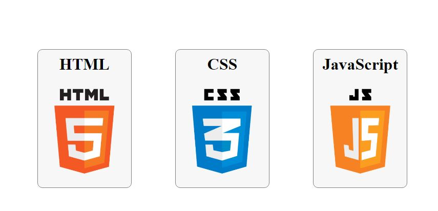
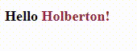

# holbertonschool-Fun-with-CSS
In this project, I experimented and implemented fun layout with HTML and CSS ONLY!

## Task 0
### With a single image, order and adding the title only modifying the CSS file.

### Image: 

### Result: 

## Task 1
### Generate an underline that is hidden by default and appeared slowly.

### Result: 